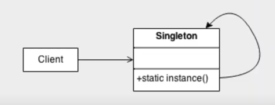
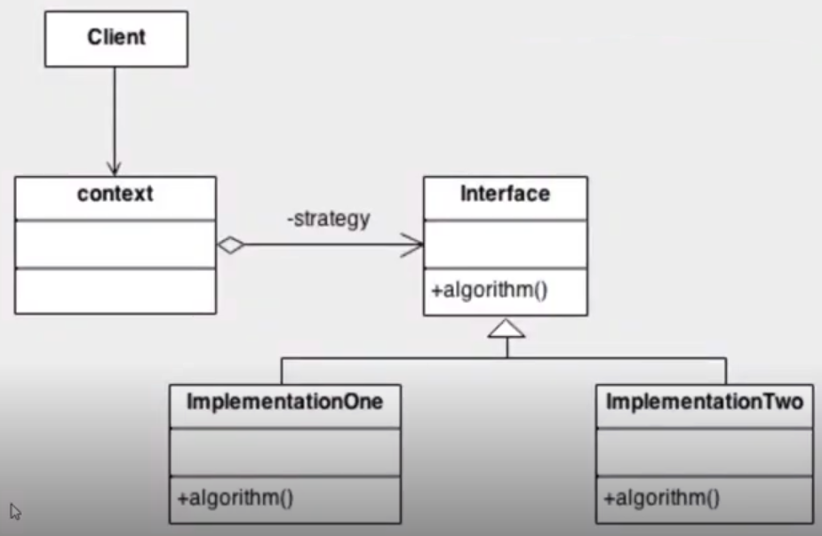
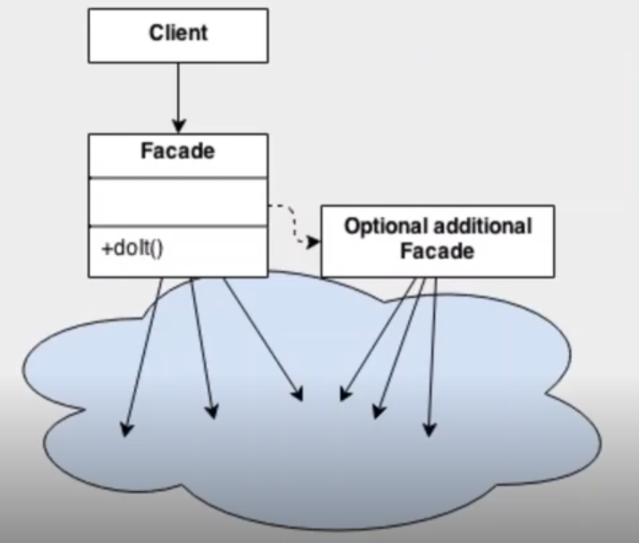

# Desenvolvimento Java com Cloud AWS | Explorando Padrões de Projeto na Prática com Java - Files & Projects

A repository containing all exercises and projects developed in the module "Explorando Padrões de Projeto na Prática com Java". 

## Description

This repository contains the following design patterns:
- Singleton;

    

- Strategy;

    

- Facade.

    

## Getting Started

### Dependencies

* Java Development Kit (JDK).

### Folder Structure
````
EXPLORANDO PADRÕES DE PROJETO NA PRÁTICA COM JAVA
├── bin
├── images
├── lib
├── src
|   ├── designpatterns
│   |   ├── singleton
│   │   |   ├── XXX.java 
│   |   ├── strategy
│   |   ├── facade
├── .gitignore
├── LICENSE
└── README.md
````

### EER models

    
## Authors

 - deArruda, Lucas [@SardinhaArruda](https://twitter.com/SardinhaArruda)

## Version History

* 0.1
    * Initial Release

## License

This project is licensed under the GPL-3.0 License - see the LICENSE.md file for details

## Acknowledgments

This README.md was based the amazing [README-Template](https://gist.github.com/DomPizzie/7a5ff55ffa9081f2de27c315f5018afc).
